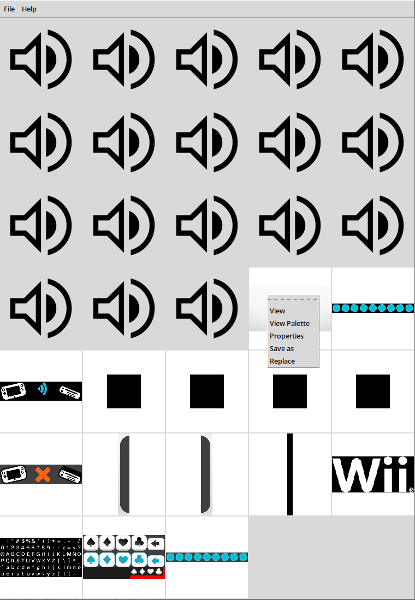

# DRC Blob Viewer
A work-in-progress DRC resource blob viewer/player and editor written in Python.



## Features
- View bitmaps
- View bitmap palletes
- Play sounds
- Extract bitmaps and sounds
- Replace bitmaps and sounds (experimental!)

## Usage

Open an extracted resource blob (for example `IMG_`) and open it.
```
Usage:
    drcblobviewer.py: <filename> [offset]
```
